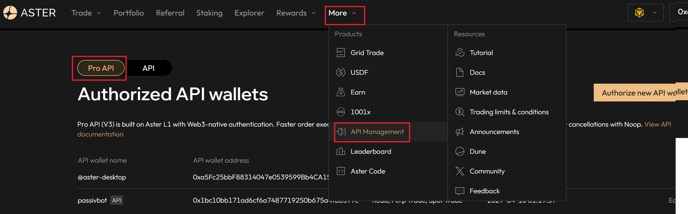

# Aster Finance Market Making Bot

Python market-making tooling for Aster Finance using WebSocket market data plus signed REST/WebSocket trading APIs.

The main strategy combines:
- Avellaneda-Stoikov style spread calculation
- SuperTrend directional bias
- Binance order-book-imbalance alpha for quote shifting
- WebSocket-based price, balance, order, and book monitoring

This is not a conventional two-sided market maker quoting bid and ask simultaneously. The current trading logic is one-sided at a time:
- when flat, it quotes only on the current bias side to open inventory
- once inventory exists, it quotes only the reducing side until that inventory is flattened

Referral link to support this work: [https://www.asterdex.com/en/referral/164f81](https://www.asterdex.com/en/referral/164f81)

## Operating Assumptions

- The market maker assumes it has exclusive control of the account and of the configured symbol in `runtime.env`.
- Do not run this bot alongside a manual trader or another bot on the same account.
- `market_maker.py` cancels all open orders for the configured symbol on startup and again during shutdown cleanup.
- If the startup cancel-all cannot be confirmed, the bot aborts instead of trading on top of unknown open orders.
- If that behavior is not acceptable for your setup, do not run the trading bot as-is.

## Quick Start

```bash
# Install dependencies
pip install -r requirements.txt

# Set `SYMBOL=ETHUSDT` in `runtime.env`, or pass explicit CLI symbols below.

# Collect market data
python data_collector.py
python data_collector.py BTCUSDT ETHUSDT

# Compute parameters from local data
python calculate_avellaneda_parameters.py ETH --minutes 5
python find_trend.py --symbol ETHUSDT --interval 5m

# Run the market maker
python market_maker.py
python market_maker.py --symbol ETHUSDT
```

## Configuration

### `.env`

You only need Aster **Pro API V3** credentials for live trading, account/user-data REST calls, and user-data listen-key management. The public `data_collector.py` flow does not require those credentials.

Use only the **Pro** API flow on the Aster website under `More -> API Management`:
- `API_USER` is your L1 EVM wallet address (for example from Rabby or MetaMask)
- `API_SIGNER` is the signer wallet address generated in `More -> API Management`
- `API_PRIVATE_KEY` is the private key for that generated signer wallet



```bash
# Pro API V3
# L1 EVM wallet address (for example Rabby / MetaMask)
API_USER=0x...

# Generated under More -> API Management
API_SIGNER=0x...
API_PRIVATE_KEY=0x...

# Optional: set to 0/false to show normal info logs from the bot
# RELEASE_MODE=0

# Optional: only for the terminal dashboard's spot balance widget
# SPOT_API_KEY=...
# SPOT_API_SECRET=...
```

### `runtime.env`

`runtime.env` is the single source of truth for the active trading/collection symbol across Docker and the main scripts.

```bash
SYMBOL=ETHUSDT
```

### Runtime Symbol Behavior

- `market_maker.py` uses `--symbol` first, then `runtime.env` `SYMBOL`.
- `data_collector.py` defaults to `runtime.env` `SYMBOL`.
- `calculate_avellaneda_parameters.py` defaults to the base ticker derived from `runtime.env` `SYMBOL` after stripping common stablecoin quotes like `USDT`, `USDC`, `USDF`, `USD1`, and `USD`.
- The local analytics loader accepts either a base ticker like `BTC` or a full symbol like `BTCUSDT`, then resolves the matching local trades/orderbook data using the available quote-suffix files.
- `find_trend.py` defaults to `runtime.env` `SYMBOL` and writes its params file using the same base-symbol normalization.
- The live trading bot and user-data stream both use Pro API V3 signer-based auth; there is no longer a separate `APIV1_*` credential requirement in this repo.
- `data_collector.py` currently stores partial order book snapshots from the top `N` levels (`@depth5/@depth10/@depth20` style streams), not a fully reconstructed local order book from diff-depth updates.
- Order book parquet output keeps the active hour in `ASTER_data/orderbook_parquet/{SYMBOL}/_latest.parquet` and archives one UTC-hour parquet per completed hour using filenames like `20260416T090000Z.parquet`.

## Main Strategy Parameters

Current defaults live in [market_maker.py](market_maker.py).

```python
DEFAULT_SYMBOL = configured_symbol()
FLIP_MODE = False
DEFAULT_BUY_SPREAD = 0.006
DEFAULT_SELL_SPREAD = 0.006
USE_AVELLANEDA_SPREADS = True
DEFAULT_BALANCE_FRACTION = 0.2
POSITION_THRESHOLD_USD = 15.0

ORDER_REFRESH_INTERVAL = 60
PRICE_REPORT_INTERVAL = 60
BALANCE_REPORT_INTERVAL = 60

USE_SUPERTREND_SIGNAL = True
SUPERTREND_CHECK_INTERVAL = 600

USE_BINANCE_OBI_ALPHA = True
BINANCE_OBI_ZSCORE_WINDOW_SECONDS = 600
BINANCE_OBI_WARMUP_SECONDS = 300
BINANCE_OBI_BPS_PER_SIGMA = 5.0
BINANCE_OBI_MAX_SHIFT_BPS = 15.0

DEFAULT_PRICE_CHANGE_THRESHOLD_BPS = 5.0
CANCEL_SPECIFIC_ORDER = True

RELEASE_MODE = env_flag("RELEASE_MODE", True)
```

Important notes:
- `DEFAULT_BALANCE_FRACTION` currently sizes from tracked wallet balances (`walletBalance` from account snapshots / user stream), not `availableBalance`.
- `POSITION_THRESHOLD_USD` controls when a position is treated as significant for bias/mode logic, but the bot still tries to flatten any non-zero position before opening fresh inventory.
- Positions that round below exchange `minQty` or `minNotional` cannot be reduced automatically and will block new openings until they are cleared.
- `DEFAULT_PRICE_CHANGE_THRESHOLD_BPS` is the single source of truth for the minimum price move required before an order is canceled and replaced.
- `ORDER_REFRESH_INTERVAL = 60` is now a safety lifetime for a working order; normal re-quoting is event-driven from best bid/ask WebSocket changes.
- If `USE_AVELLANEDA_SPREADS = True`, the bot will not place limit orders until a valid Avellaneda params file exists; it stays idle instead of falling back to static spreads when historical data is still insufficient.
- The Avellaneda calculator clamps each side's computed spread to configurable guardrails in `config.json -> avellaneda_calculation.spread_limits_bps` (default `5` to `200` bps), prints warnings when clamping happens, and the live bot enforces the same saved limits when building dynamic quotes.
- The static `+/-0.6%` fallback is only used when `USE_AVELLANEDA_SPREADS = False`.
- `USE_BINANCE_OBI_ALPHA = True` enables a Binance futures order-book-imbalance signal that shifts reservation/limit prices and blocks new opening quotes until the signal has warmed up for at least 300 seconds and 100 samples.
- Opening quotes are also blocked unless the configured symbol is in `TRADING` status and the tracked wallet balance is large enough for the exchange minimum opening order size with a safety buffer.
- The bot assumes exclusive ownership of the account and symbol, cancels all open orders for the configured symbol during startup and shutdown, and aborts startup if it cannot confirm the initial cleanup.
- `RELEASE_MODE=0` enables normal info-level logs; `RELEASE_MODE=1` keeps the quieter error-only behavior.

## Available Scripts

```bash
# Trading
python market_maker.py
python market_maker.py --symbol ETHUSDT

# Data / analytics
python data_collector.py
python calculate_avellaneda_parameters.py ETH
python find_trend.py --symbol ETHUSDT --interval 5m

# Monitoring / utilities
python terminal_dashboard.py
python get_my_trading_volume.py --symbol ETHUSDT --days 7
python get_my_trading_volume.py --days 30
```

## Terminal Dashboard

`terminal_dashboard.py` gives a live account view with:
- balances
- open positions
- recent order activity

```bash
python terminal_dashboard.py
```


## Docker

The Compose stack now supports the full automated loop in [docker-compose.yml](docker-compose.yml):
- `data-collector` gathers the symbol configured in `runtime.env`
- `avellaneda-params` retries parameter generation every 5 minutes
- `trend-finder` refreshes the Supertrend file every 5 minutes
- `market-maker` waits for a valid Avellaneda file, a valid Supertrend file, and Binance OBI warmup before it begins opening quotes

```bash
docker-compose build
docker-compose up -d
docker-compose logs -f data-collector avellaneda-params trend-finder market-maker
docker-compose down
```

If you only want background market-data collection, `docker compose up -d data-collector` does not require a `.env` file or live credentials. Change `runtime.env` to switch the collected symbol, and use `.env` only for real API credentials.

For a fresh symbol like `ETHUSDT`, the automated stack will not quote immediately on a fresh machine. It will first collect ETH data, then `avellaneda-params` will keep retrying until there is enough continuous history to write a valid `params/avellaneda_parameters_ETH.json`, and `trend-finder` will write `params/supertrend_params_ETH.json`. Once both files are valid and the Binance OBI alpha has warmed up, the running market maker can begin quoting automatically.

## Testing

Local-safe tests run by default and skip live exchange scripts unless you opt in.

If `pytest` is not already installed in your environment, install it separately first because it is not pinned in `requirements.txt`.

```bash
pip install pytest

pytest -q

# Only if you intentionally want live API test collection:
RUN_LIVE_API_TESTS=1 pytest -q
```

The default test suite does not place live trades. It covers local order-state logic, filter rounding, parameter-file loading, and analytics helpers.

## Performance Notes

Low latency matters for market making, especially if you reduce `ORDER_REFRESH_INTERVAL`.

Recommendations:
- Prefer an Asia-Pacific region close to the exchange
- AWS Tokyo (`ap-northeast-1`) is the suggested baseline
- Avoid noisy shared infrastructure during active trading periods

## Risk Warning

This software will likely lose money, even if it generates significant volume, because it is not competitive with professional firms. Start with very small amounts and make sure you understand the risks of automated crypto trading.
