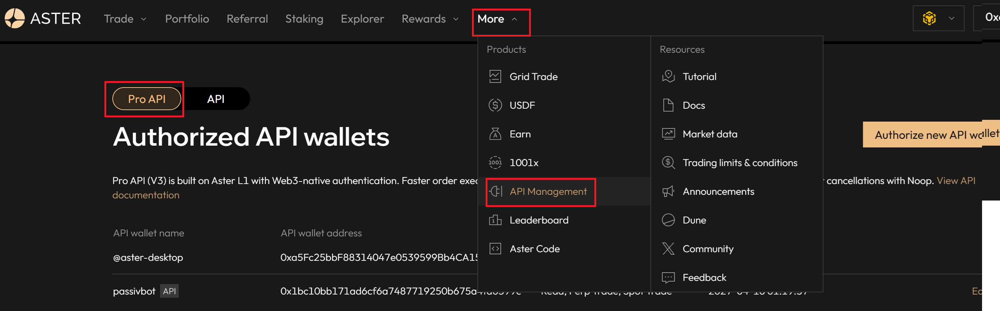

# Aster Finance Market Making Bot

Python market-making tooling for Aster Finance using WebSocket market data plus signed REST/WebSocket trading APIs.

The strategy is a two-sided volatility + order-book-imbalance (Vol+OBI) market maker, ported from the lighter_MM project:
- volatility (from Binance 100ms mid-price changes) sets the half-spread width
- a Binance order-book-imbalance z-score (alpha) shifts the fair price around the Aster mid
- inventory skew widens the position-increasing side and tightens the reducing side
- the position-increasing side is suppressed entirely at a dynamic max-position cap
- WebSocket-based price, balance, order, and book monitoring; non-blocking logging on the hot path

The bot quotes bid and ask simultaneously (one level per side) with GTX post-only orders.

Referral link to support this work: [https://www.asterdex.com/en/referral/164f81](https://www.asterdex.com/en/referral/164f81)

## Operating Assumptions

- The market maker assumes it has exclusive control of the account and of the active trading symbol.
- Do not run this bot alongside a manual trader or another bot on the same account.
- `market_maker.py` cancels all open orders for the configured symbol on startup and again during shutdown cleanup.
- If the startup cancel-all cannot be confirmed, the bot aborts instead of trading on top of unknown open orders.
- If that behavior is not acceptable for your setup, do not run the trading bot as-is.

## Quick Start

```bash
# Install dependencies
pip install -r requirements.txt

# Set `SYMBOL=ETHUSDT` in `runtime.env`, or pass explicit CLI symbols below.

# Run the market maker (no parameter files required — the Vol+OBI signal
# warms up from the live Binance depth stream in ~10-60 seconds)
python market_maker.py
python market_maker.py --symbol ETHUSDT

# Optional analytics tooling (not used by the live bot)
python data_collector.py
python calculate_avellaneda_parameters.py ETH --minutes 5
python find_trend.py --symbol ETHUSDT --interval 5m
```

## Configuration

### `.env`

You only need Aster **Pro API V3** credentials for live trading, account/user-data REST calls, and user-data listen-key management. The public `data_collector.py` flow does not require those credentials.

Use only the **Pro** API flow on the Aster website under `More -> API Management`:
- `API_USER` is your L1 EVM wallet address (for example from Rabby or MetaMask)
- `API_SIGNER` is the signer wallet address generated in `More -> API Management`
- `API_PRIVATE_KEY` is the private key for that generated signer wallet



```bash
# Pro API V3
# L1 EVM wallet address (for example Rabby / MetaMask)
API_USER=0x...

# Generated under More -> API Management
API_SIGNER=0x...
API_PRIVATE_KEY=0x...

# Optional for native runs: set to 0/false to show normal info logs from the bot
# Note: `docker-compose.yml` currently forces `RELEASE_MODE=0` for the `market-maker` service.
# RELEASE_MODE=0
```

### `runtime.env`

`runtime.env` is the default symbol configuration file across Docker and the main scripts. CLI flags can override it, and `data_collector.py` also accepts a separate `SYMBOLS` env var.

```bash
SYMBOL=ETHUSDT
```

### Runtime Symbol Behavior

- `market_maker.py` uses `--symbol` first, then `runtime.env` `SYMBOL`.
- `data_collector.py` defaults to `runtime.env` `SYMBOL`, unless you pass positional CLI symbols or set `SYMBOLS`.
- `calculate_avellaneda_parameters.py` defaults to the base ticker derived from `runtime.env` `SYMBOL` after stripping common stablecoin quotes like `USDT`, `USDC`, `USDF`, `USD1`, and `USD`.
- The local analytics loader accepts either a base ticker like `BTC` or a full symbol like `BTCUSDT`, then resolves the matching local trades/orderbook data using the available quote-suffix files.
- `find_trend.py` defaults to `runtime.env` `SYMBOL` and writes its params file using the same base-symbol normalization.
- The live trading bot and user-data stream both use Pro API V3 signer-based auth; there is no longer a separate `APIV1_*` credential requirement in this repo.
- `data_collector.py` currently stores partial order book snapshots from the top `N` levels (`@depth5/@depth10/@depth20` style streams), not a fully reconstructed local order book from diff-depth updates.
- Order book parquet output keeps the active hour in `ASTER_data/orderbook_parquet/{SYMBOL}/_latest.parquet` and archives one UTC-hour parquet per completed hour using filenames like `20260416T090000Z.parquet`.

## Main Strategy Parameters

Current defaults live in [market_maker.py](market_maker.py). The `OBI_*` knobs are env-overridable.

```python
DEFAULT_SYMBOL = configured_symbol()
DEFAULT_LEVERAGE = 1
DEFAULT_BALANCE_FRACTION = 0.2

# Vol+OBI strategy (lighter_MM port)
OBI_WINDOW_STEPS = 6000              # rolling window for vol/imbalance stats
OBI_STEP_NS = 100_000_000            # Binance diff-depth cadence (100ms)
OBI_VOL_TO_HALF_SPREAD = 42.0        # env OBI_VOL_TO_HALF_SPREAD — primary tuning knob
OBI_MIN_HALF_SPREAD_BPS = 4.0        # env OBI_MIN_HALF_SPREAD_BPS — spread floor per side
OBI_C1_TICKS = 120.0                 # env OBI_C1_TICKS — alpha -> fair-price shift (ticks/sigma)
OBI_SKEW = 1.5                       # env OBI_SKEW — inventory skew gain
OBI_LOOKING_DEPTH = 0.025            # imbalance band: +/-2.5% around Binance mid
OBI_MIN_WARMUP_SAMPLES = 100         # samples before quoting starts
MAX_POSITION_SAFETY_FACTOR = 0.9     # headroom under the leverage-derived position cap

ORDER_REFRESH_INTERVAL = 60
DEFAULT_PRICE_CHANGE_THRESHOLD_BPS = 5.0

RELEASE_MODE = env_flag("RELEASE_MODE", True)
```

How the quote is built each cycle:
1. `half_spread = volatility * OBI_VOL_TO_HALF_SPREAD` (volatility = per-second std of Binance mid changes)
2. `fair_price = aster_mid + OBI_C1_TICKS * tick_size * alpha` (alpha = imbalance z-score)
3. `norm_pos = clamp(position_usd / max_position_usd, -1, 1)`; bid depth scales by `(1 + OBI_SKEW * norm_pos)`, ask depth by `(1 - OBI_SKEW * norm_pos)`
4. `OBI_MIN_HALF_SPREAD_BPS` floors both sides; quotes snap to the tick grid; crossed quotes are never emitted
5. at the dynamic position cap (`(balance * leverage - 2 * order_value) * 0.9`) the increasing side is suppressed and the surviving side is flagged reduce-only

Important notes:
- `DEFAULT_BALANCE_FRACTION` sizes each side from tracked wallet balances (`walletBalance` from account snapshots / user stream), not `availableBalance`.
- Positions that round below exchange `minQty` or `minNotional` cannot be reduced automatically.
- `DEFAULT_PRICE_CHANGE_THRESHOLD_BPS` is the single source of truth for the minimum price move required before a side is canceled and replaced; reuse is price-only per side.
- `ORDER_REFRESH_INTERVAL = 60` is a safety lifetime for a working order; normal re-quoting is event-driven from the Aster top-of-book and the Binance alpha stream.
- Quoting is blocked until the Vol+OBI signal is warmed up (`OBI_MIN_WARMUP_SAMPLES` Binance depth samples) and is pulled whenever the Binance feed disconnects or goes stale for more than 5 seconds. Warmup restarts after every Binance reconnect by design.
- Orders are GTX post-only; quotes that would cross the opposite side of the Aster book are clamped one tick inside it.
- Opening quotes are also blocked unless the configured symbol is in `TRADING` status and the tracked wallet balance is large enough for the exchange minimum opening order size with a safety buffer.
- The bot assumes exclusive ownership of the account and symbol, cancels all open orders for the configured symbol during startup and shutdown, and aborts startup if it cannot confirm the initial cleanup.
- `RELEASE_MODE=0` enables normal info-level logs; `RELEASE_MODE=1` keeps the quieter error-only behavior. Logging is non-blocking (queue-based) so it never stalls the trading hot path, and `market_maker.log` rotates at 50MB with 5 backups.
- Other hot-path latency measures: WebSocket payloads are parsed with `orjson`, and EIP-712 request signing runs in a worker thread so the event loop never stalls on crypto math.

## Available Scripts

```bash
# Trading
python market_maker.py
python market_maker.py --symbol ETHUSDT

# Data / analytics
python data_collector.py
python calculate_avellaneda_parameters.py ETH
python find_trend.py --symbol ETHUSDT --interval 5m
```

## Docker

The Compose stack in [docker-compose.yml](docker-compose.yml):
- `market-maker` is self-contained: it only needs `.env` credentials and Binance/Aster WebSocket connectivity, then begins quoting once the Vol+OBI signal has warmed up (about 10-60 seconds)
- `data-collector`, `avellaneda-params`, and `trend-finder` are optional analytics services; the live bot no longer reads their output

```bash
docker compose build
docker compose up -d market-maker
docker compose logs -f market-maker
docker compose down
```

If you only want background market-data collection, `docker compose up -d data-collector` does not require a `.env` file or live credentials. Change `runtime.env` to switch the collected symbol, and use `.env` only for real API credentials.

## Testing

Local-safe tests run by default and skip live exchange scripts unless you opt in.

If `pytest` is not already installed in your environment, install it separately first because it is not pinned in `requirements.txt`.

```bash
pip install pytest

pytest -q

# Only if you intentionally want live API test collection:
RUN_LIVE_API_TESTS=1 pytest -q
```

The default test suite does not place live trades. It covers the Vol+OBI strategy math, two-sided quote construction, per-side order-state logic, filter rounding, and analytics helpers.

## Performance Notes

Low latency still matters for market making, although normal re-quoting is event-driven and `ORDER_REFRESH_INTERVAL` mainly acts as a safety timeout for stale working orders.

Recommendations:
- Prefer an Asia-Pacific region close to the exchange
- AWS Tokyo (`ap-northeast-1`) is the suggested baseline
- Avoid noisy shared infrastructure during active trading periods

## Risk Warning

This software will likely lose money, even if it generates significant volume, because it is not competitive with professional firms. Start with very small amounts and make sure you understand the risks of automated crypto trading.
